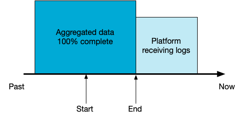

# Akamai CLI: Enterprise Threat Protector<!-- omit in toc -->

## Table of contents<!-- omit in toc -->

- [Introduction](#introduction)
- [Prerequisites](#prerequisites)
  - [Akamai CLI](#akamai-cli)
- [Install](#install)
  - [API User and configuration file](#api-user-and-configuration-file)
- [Updating ETP CLI module](#updating-etp-cli-module)
- [Examples](#examples)
  - [Fetch events](#fetch-events)
  - [Manage security lists](#manage-security-lists)
    - [Add items to a list](#add-items-to-a-list)
    - [Deploy list changes](#deploy-list-changes)
- [Troubleshooting](#troubleshooting)
  - [ERROR: Exiting with code 404, reason: Code-130009](#error-exiting-with-code-404-reason-code-130009)

## Introduction

Enterprise Threat Protector (ETP) comes with a full suite of APIs. 
Yet you need to build scripts to be able to interact with the service.

That's where Akamai CLI toolkit greatly help, no longer script to wrote yourself, you can run very common operations directly from the command line.

## Prerequisites

### Akamai CLI

You'll need the CLI toolkit, available on many platform.

Please visit the [Getting Started](https://developer.akamai.com/cli/docs/getting-started) guide on developer.akamai.com.

## Install

Installation is done via `akamai install`:

```
$ akamai install etp
```

Running this will run the system `python setup.py` automatically. 

### API User and configuration file

On [Akamai Control Center](https://control.akamai.com), make sure you create an API user 
with the _ETP Configuration API_ (`/etp-config`) with read-write permission.

Upon user credential creation, you'll get a `.edgerc` file with 4 parameters.
You'll need to add a 5th line with the `etp_config_id`. 

The value of the parameter is a integer you can obtain by navigating in Akamai Control Center: 

- Select Enterprise Threat Protector from the left menu
- Select Utilities 
- Select ETP Client tab 
- Locate _customer identifier_ on the right

Example of `.edgerc` file:
```
[default]
client_secret = client-secret-goes-here
host = akab-xxxx.luna.akamaiapis.net
access_token = your-access-token
client_token = your-client-token
etp_config_id = your-ETP-config-ID
```

## Updating ETP CLI module

To update to the latest version:

```
$ akamai update etp
```

## Examples

### Fetch events

Fetch the latest security events with the `event` command.



If `--start` is not specified, we set it to 45 minutes ago  
If `--end` is not specified, we set it to 30 minutes ago

Both argument expect a EPOCH timestamp.

```
$ akamai etp event threat
```

or Accceptable Use Policy

```
$ akamai etp event aup
```

You may want to use the blocking mode using `--tail`

```
$ akamai etp event aup --tail
```

You can also send the output to a specific file (appending mode) with `--output`:

```
$ akamai etp event aup --tail --output /tmp/etp_event_aup.json
```

When using the block mode, you can gracefully stop the command process:
- either manually with Control+C (Control-Break)
- or sending a SIG_TERM signal

You can also pipe the command to another process like your favorite JSON parser like _jq_ or _ConvertFrom-Json_ in Powershell.

```
$ akamai etp event aup --start 1576877365 --end 1576878265|jq .
```

### Manage security lists

Get the lists available on the account
```
$ akamai etp list get
```

The result is a coma separated lines:

```
7721,Custom Blacklist
11981,LOLCats Blacklist
11603,Zero Trust Demo Blacklist
11821,Zero Trust Demo Whitelist
14461,Social Media
14821,White List Domains
13641,Serial sequence testing
```

#### Add items to a list

One FQDN
```
$ akamai etp list add 11603 www.badguys.com
```

One IP address
```
$ akamai etp list add 11603 12.34.56.78
```

Mix of multiple items
```
$ akamai etp list add 11603 12.34.56.78 www.badguys.com
```

Load item from a file
```
$ akamai etp list add 11603 @list.txt
```

You can use pipe command
```
$ cat list.txt | akamai etp list add 11603 @-
```

Or type in and hit Ctrl+D when done
```
$ akamai etp list add 11603 @-
```

You can replace 'add' by 'remove' in the example above to remove items from list.

#### Deploy list changes

```
$ akamai etp list deploy 11603
```

## Troubleshooting

### ERROR: Exiting with code 404, reason: Code-130009

Make sure the API user has access to the ETP Config ID defined the `.edgerc` file, typically a mismatch will cause the 404 error.